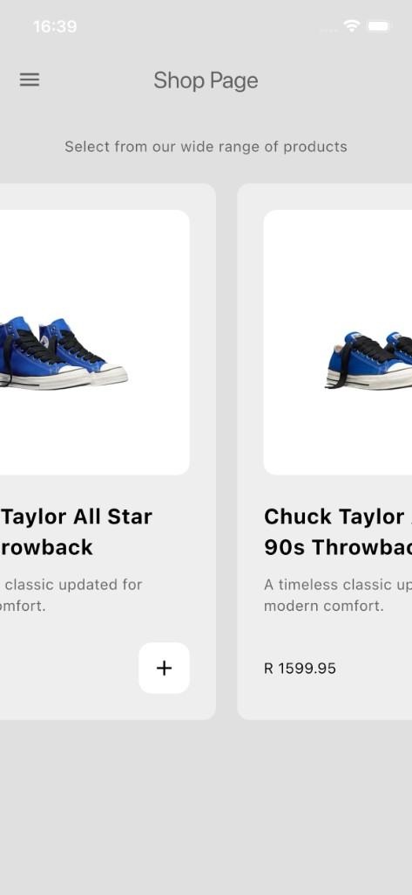
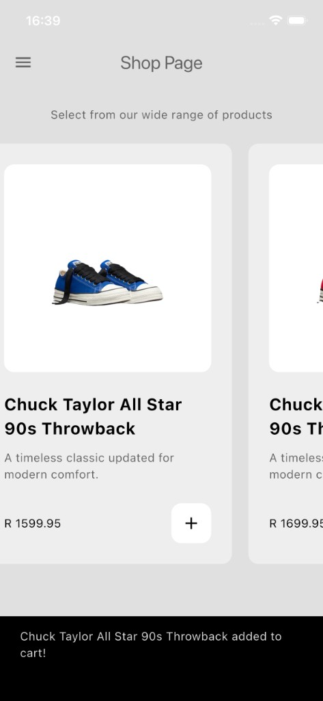
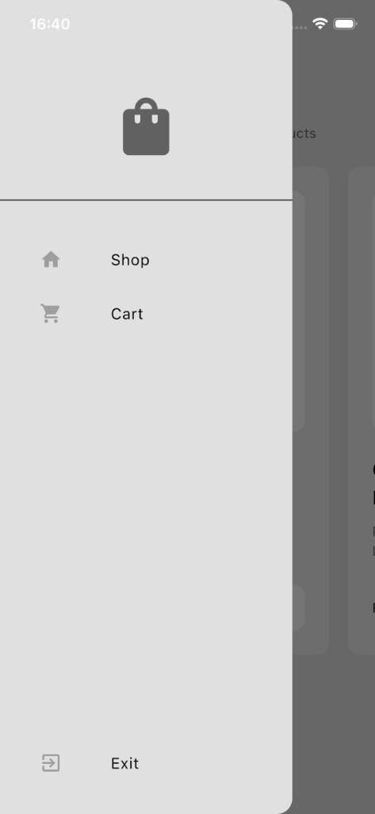
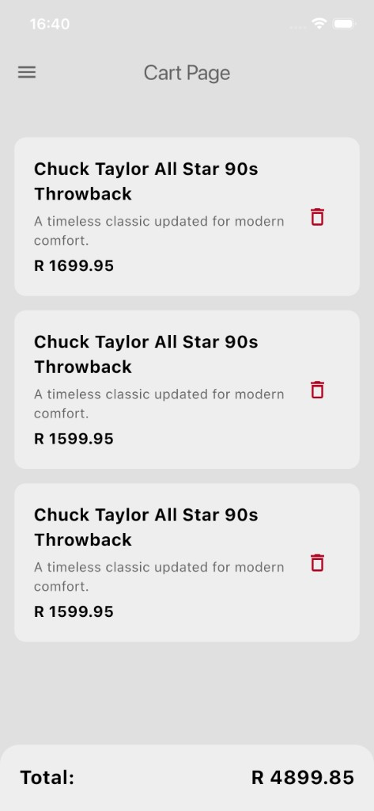

# Cartify

**Your shopping companion** - A modern Flutter e-commerce app for browsing products and managing your shopping cart.

## Overview

Cartify is a clean, minimalist shopping app built with Flutter that allows users to browse products, add items to their cart, and manage their shopping experience with an intuitive interface.

## Features

- **Shop Page** - Browse through a wide range of products in a horizontal scrollable layout
- **Shopping Cart** - Add products to cart and manage your items
- **Cart Management** - View cart total, remove items, and see real-time updates
- **Modern UI** - Clean, minimalist design with smooth animations
- **Notifications** - Toast notifications when items are added or removed from cart
- **Navigation Drawer** - Easy navigation between Shop and Cart pages

## Screenshots

### Welcome Screen


### Shop Page


### Adding to Cart


### Navigation Drawer


### Cart Page


## Tech Stack

- **Framework**: Flutter 3.11.0+
- **State Management**: Flutter Riverpod 2.6.1
- **Navigation**: GoRouter 17.1.0
- **Language**: Dart

## Installation

### Prerequisites

- Flutter SDK (3.11.0 or higher)
- Dart SDK
- iOS Simulator or Android Emulator (or a physical device)

### Steps

1. **Clone the repository**
   ```bash
   git clone <repository-url>
   cd cartify
   ```

2. **Install dependencies**
   ```bash
   flutter pub get
   ```

3. **Run the app**
   ```bash
   flutter run
   ```

## Usage

1. **Browse Products**: Open the app and navigate to the Shop Page to see available products
2. **Add to Cart**: Tap the "+" button on any product card to add it to your cart
3. **View Cart**: Open the navigation drawer and select "Cart" to view your items
4. **Remove Items**: Tap the delete icon on any cart item to remove it
5. **View Total**: The cart page automatically calculates and displays your total

## 📁 Project Structure

```
lib/
├── components/
│   ├── my_drawer.dart          # Navigation drawer component
│   └── product_tile.dart       # Product card component
├── model/
│   ├── product.dart            # Product data model
│   └── shop.dart               # Shop model with cart logic
├── navigation/
│   └── routes.dart             # App routing configuration
├── pages/
│   ├── cart_page.dart          # Cart page UI
│   └── shop_page.dart          # Shop page UI
├── providers/
│   └── shop_provider.dart      # Riverpod provider for shop state
├── themes/
│   └── light_mode.dart         # App theme configuration
└── main.dart                   # App entry point
```

## Key Components

- **Shop Model**: Manages product inventory and user cart
- **Riverpod Providers**: Handles state management across the app
- **GoRouter**: Manages navigation and routing
- **Product Tiles**: Reusable product card components
- **Cart Management**: Add/remove items with real-time updates

## 📝 License

This project is a private Flutter application.

## 🤝 Contributing

This is a personal project. Contributions and suggestions are welcome!

---
